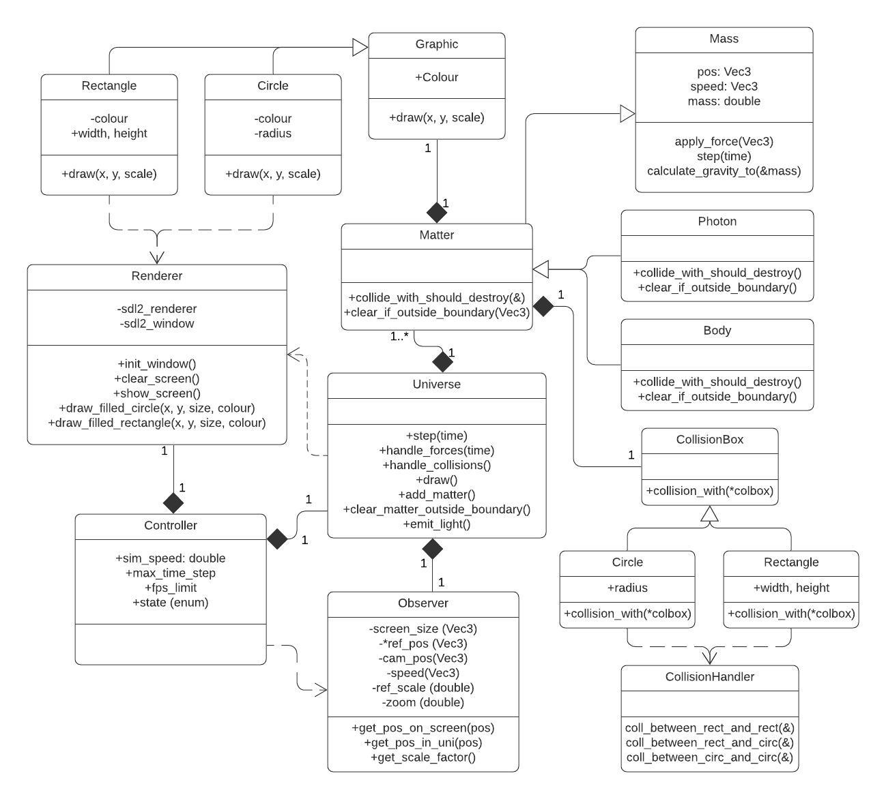

# LightAndTimeDialiation
This project will be a *very* simplified simulation of the creation of a galaxy or sun from a gas cloud. However, the **goal** is to learn more about C++ and OOP best practices, by rewriting a previous project called [UniverseSimulation](https://github.com/heinwessels/UniverseSimulator). The idea is to over-design everything to force the use of best practices that will typically be used for large commercial projects.

## Development Process
The process I during the development of this project is as follows:

1. **Design Class Structure with UML.** I first designed the class layout using UML, looking into best practices, etc. It gave me a good idea of what the problems are that I will have to solve and what tools are available (e.g. composition, polymorphism, etc.).
2. **Implement and Refine Structure.** I implemented the structure I thought would work, and then refined, redesiged, and restructured until the software was well rounded.
3. **Document Structure and Lessons Learned.** *(I'm here)* Before implementing the final physics, I wanted to document my findings and lessons learned while it's still fresh. I updated the UML diagram, and I'm working on *this* README.
4. **Add Relativity Physics.** *(TODO)* Add cool physics.

## Final Class Structure and UML

I designed the class structure using a UML diagram using LucidChart. I favoured composition over inheritance, for example `Matter` `has-a` `Graphic` and `CollisionBox`, rather than `is-a`. Although, I did find that `matter` inheriting `mass` made the code much cleaner and readable, which I believe is sometimes more important.

## Lessons Learned
- Having raw arrays of polymorphism objects is **really bad**, because it will cause slicing. The solution is to use a array of pointers, or even better, `std:unique_ptr`. This will ensure uncompromised memory, and no accidental memory leaks if used correctly. However, rather storing pointers is bad for caching, since the objects won't neccesarily be sequential in memory, but this is an optimization problem, and negligible in our case.
- There's little reason to use raw arrays. A container, e.g. `std::vector`, is just as efficient if used correctly, and has some powerful capabilities.
- Favour *composition* over *inheritance*. This makes the code more modular and future proof. However, *inheritance* still has it's benifits, such as readability.
- With derived classes `virtual` functions are very powerful and can make polymorhism very easy, intuitive and readable.
- A `dynamic_cast` is very slow and should be avoided where possible. Rather use other methods to determine if a derived class is of certain type.
- Similarly, `std::unique_ptr::get()` is also very slow. This was an issue when calling a function with a polymorphic `unique_ptr` as argument. The `unique_ptr` itself can't be used, so instead `unique_ptr.get()` was used, but this proved very slow. Therefore, the argument was changed from pointer to reference, and now only `*unique_ptr` has to be used. This proved much quicker on `kcachegrind`.
- Ideally base classes should not know about their derived classes, and the derived classes should not know about each other. This was hard to implement for `CollisionBox` and isn't perfect (they know a little), but was made easier by using a *Factory Pattern* and implementing a `CollisionHandler`.

## TODO
- Remove `dynamic_cast` in collision detection. Change to `Separating Axis Theorem`?
- Fix processing loop during idle times.
- Improve circle drawing algorithm to use Bresenham, if it's an issue in speed.
- Remove dependency between `Universe` and `Renderer`.

## Improvements from previous Universe Simulation
- Simulation speed per second is constant, e.g. `200 seconds per second`. If the processing takes too long it will increase the time step per calculation to reduce the number of calculations, instead of limiting the amount calculations with a fixed time step. This will decrease the accuracy *slightly*, but it's negligible. This is an improvement from trying to reach a specific number of updates per second with a fixed timestep, meaning when the processing is slow, the simulation is slow.
- Now simulating density (TODO)