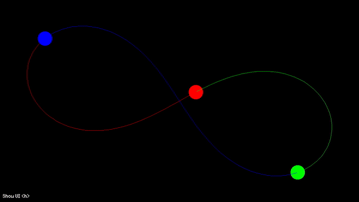

# Universe (Gravity) Simulation
This project will be a *very* simplified simulation of the creation of a galaxy or solar system from a gas cloud. However, the **goal** is to learn more about C++ and OOP best practices by rewriting a previous project called [UniverseSimulation](https://github.com/heinwessels/UniverseSimulator). The idea is to over-design everything to force the use of best practices that will typically be used for large commercial projects.

Below is an example of the implemented gravity simulation:

## Development Process
The process I during the development of this project is as follows:

1. **Design Class Structure with UML.** I first designed the class layout using UML, looking into best practices, etc. It gave me a good idea of what the problems are that I will have to solve and what tools are available (e.g. composition, polymorphism, etc.).
2. **Implement and Refine Structure.** I implemented the structure I thought would work, and then refined, redesiged, and restructured until the software was well rounded and running smoothly.
3. **Document Structure and Lessons Learned.** Before implementing the final physics, I wanted to document my findings and lessons learned while it's still fresh. I updated the UML diagram (although it's out of date already).
4. **Refine Physics and Optimize.** Added trails to bodies. Implemenented various templates for diferrent systems (solar system, gas cloud, figure-eight, etc). Added more controller functionality (follow body, zoom, pan, speed, etc). And most importantly, I **optimized**. This was done using `kcachegrind` to see where the program truly spends most of it's time, rather than optimizing algorithms that does not have a big effect.

## Final Class Structure and UML

I designed the class structure using a UML diagram using LucidChart. I favoured composition over inheritance, for example `Matter` `has-a` `Graphic` and `CollisionBox`, rather than `is-a`. Although, I did find that `matter` inheriting `mass` made the code much cleaner and readable, which I believe is sometimes more important.

**Note:** This UML diagram is slightly out of date. The basic layout is still the same, although it has grown a few more functions. Also, it still shows the `Photon` derived object which is from when this project was meant to simulate general relativity. I figured out most of the equations I needed, but couldn't figure out how much light should bend when experiencing gravity from `n` bodies. So I changed the focus to simply be a improved gravity simulation.

## Lessons Learned
- Having raw arrays of polymorphism objects is **really bad**, because it will cause slicing. The solution is to use a array of pointers, or even better, `std:unique_ptr`. This will ensure uncompromised memory, and no accidental memory leaks if used correctly. However, rather storing pointers is bad for caching, since the objects won't neccesarily be sequential in memory, but this is an optimization problem, and negligible in our case.
- There's little reason to use raw arrays. A container, e.g. `std::vector`, is just as efficient if used correctly, and has some powerful capabilities.
- Favour *composition* over *inheritance*. This makes the code more modular and future proof. However, *inheritance* still has it's benifits, such as readability.
- With derived classes `virtual` functions are very powerful and can make polymorhism very easy, intuitive and readable. Remember to tag derived `virtual` functions as `override`.
- A `dynamic_cast` is very slow and should be avoided where possible (observed through `kcachegrind`). Rather use other methods to determine if a derived class is of certain type. Or change the design to not require a dynamic casting.
- Similarly, `std::unique_ptr::get()` is very slow. This was an issue when calling a function with a polymorphic `unique_ptr` as argument. The `unique_ptr` itself can't be used, so instead `unique_ptr.get()` was used, but this proved very slow. Therefore, the argument was changed from pointer to reference, and now only `*unique_ptr` has to be used. This proved much quicker on `kcachegrind`. (Was not tested with optimizations turned on)
- Ideally base classes should not know about their derived classes, and the derived classes should not know about each other. This was hard to implement for `CollisionBox` and isn't perfect (they know a little), but was made easier by using a *Factory Pattern* and implementing a `CollisionHandler`.

## Improvements from previous Universe Simulation
- Simulation speed per second is constant, e.g. `200 seconds per second`. If the processing takes too long it will increase the time step per calculation to reduce the number of calculations, instead of limiting the amount calculations with a fixed time step. This will decrease the accuracy *slightly*, but it's negligible. This is an improvement from trying to reach a specific number of updates per second with a fixed timestep, meaning when the processing is slow, the simulation is slow.
- Much better controls. You can pan the camera and zoom in and out intuitively. A very useful feature is being able to clock on a object to follow. The simulation can also be set to favour simulation speed over FPS, which is used to record the simulation in true simulated time.
- Other things, like class layout, scalability and modularity. Different colours. Better collisions. Support rectangular shapes (although it wasn't used in the end).

## Some Sweet Gifs and Images

### Figure Eight Orbit
Below is an example showing a specific gravity simulation called **The Figure Eight Solution**. It shows a special case where the three-body-problem has an analytical solution, which means the three bodies are in a periodic orbit. This is a normal gravity simulation, but notice how in sync the bodies is. Typically 3 bodies orbiting around each other is very chaotic and unpredictable.

To truly understand the *perfection* of this famous orbit its worth knowing that it was only discovered in *1993*. To put this in perspective, Isaac Netwon derived the gravity equation in *1687*, which is all this simulation uses. That's a 300 year gap, in which humans discovered black holes, determined the universe is expanding, founded General Relativity, sent satellites to sling by 4 different planets without crashing and escape our solar system, and landed people on the moon  multiple times! And only after all that did we find this beautiful stable 3 body orbit.

### Earth and Moon around Sun
Below is an simulation show with the moon **orbiting around the earth**, and both orbiting around the sun. For this recording the UI information is shown, so it's visible that it takes around 30 days for the moon to travel around the Earth (see `Simulation Time Passed`). To give an idea of the scale of our solar system: if rendering the both sun and earth on a 1000x1000 pixel window at their true locations, the earth is 1 pixel big and the sun is only 4 pixels big!

